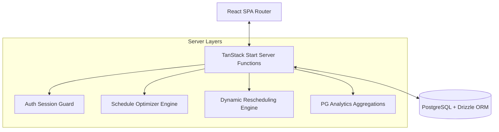
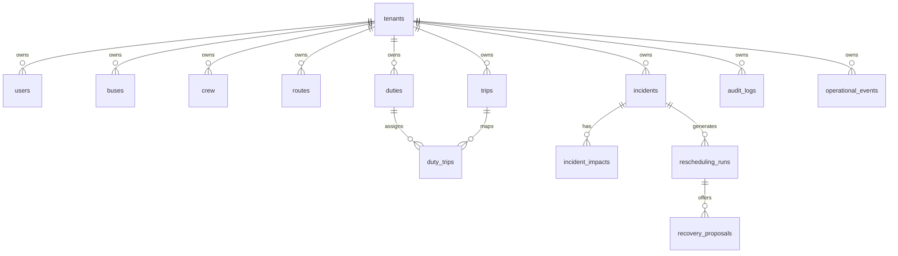

# TransitOS Complete Final System Architecture

This document maps the complete system architecture of the TransitOS multi-tenant SaaS platform.

## 1. Technical Stack

- **Frontend Core**: React 19 + TanStack Router + Vite + TailwindCSS.
- **Client State**: TanStack Query (React Query) + Lucide Icons.
- **Data Visualizations**: Leaflet GIS Maps + CSS timelines.
- **Backend Edge Functions**: TanStack Start (Server Functions / RPC).
- **Database Layer**: PostgreSQL + Drizzle ORM + Drizzle Migrations.
- **Authentication**: JWT HTTP-only cookies + Password hashing.

---

## 2. Dynamic Architectural Blueprint

---

## 3. Database Schema Overview

---

## 4. Multi-Tenancy & Security Isolation

Every database query routes through the server context helper `withTenant(dbQuery)` to enforce scope bounds:
- **Tenant Isolation**: Injects `eq(table.tenantId, session.tenantId)` to all queries.
- **RBAC Matrix**: Enforced both on route levels (`beforeLoad` router guards) and server functions mutations.
- **Audit Logs**: Logs administrative operations (e.g. `OPTIMIZATION_PUBLISHED`, `ANALYTICS_EXPORT`) into the `audit_logs` table.
