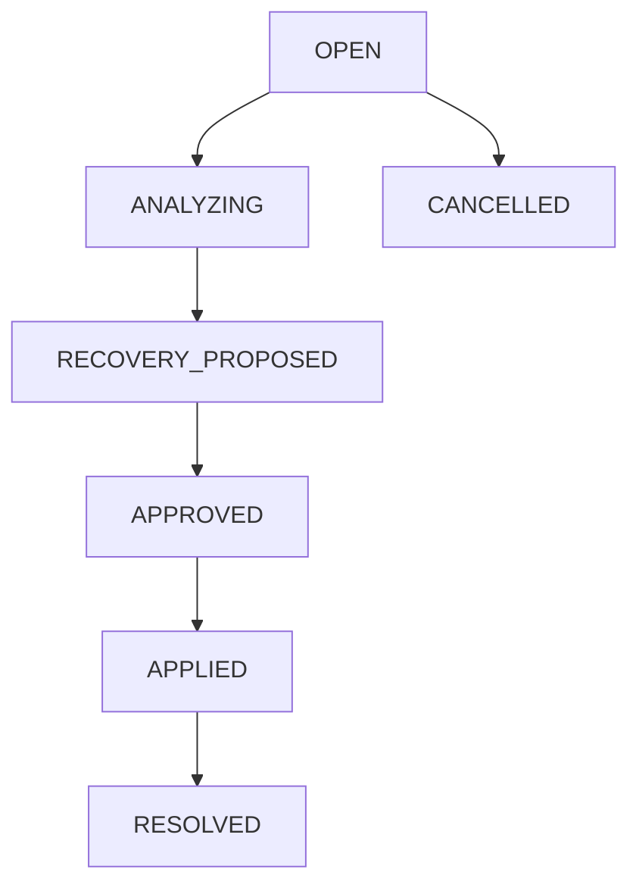

# Incident Management Architecture

TransitOS logs and monitors service disruptions via the `incidents` registry.

## Configurable Incident Types

- **`BUS_BREAKDOWN`**: Bus breaks down during operation.
- **`BUS_UNAVAILABLE`**: Bus fails to depart from depot.
- **`DRIVER_ABSENT` / `CONDUCTOR_ABSENT`**: Scheduled crew member fails to show up for duty.
- **`CREW_EMERGENCY`**: Crew emergency during shift.
- **`TRIP_DELAY`**: Delays of active trips.
- **`TRIP_CANCELLED`**: Cancelled trips.
- **`ROUTE_BLOCKED`**: GIS route blockages.
- **`MANUAL_DISRUPTION`**: Manual dispatcher interventions.

## Incident Status Flow

- **`OPEN`**: Incident reported.
- **`ANALYZING`**: Direct and downstream impacts mapped in PostgreSQL.
- **`RECOVERY_PROPOSED`**: Alternate recovery proposals generated.
- **`APPLIED`**: Recovery proposal approved and written transactionally.
- **`RESOLVED`**: Disrupted resource restored to active service status.
